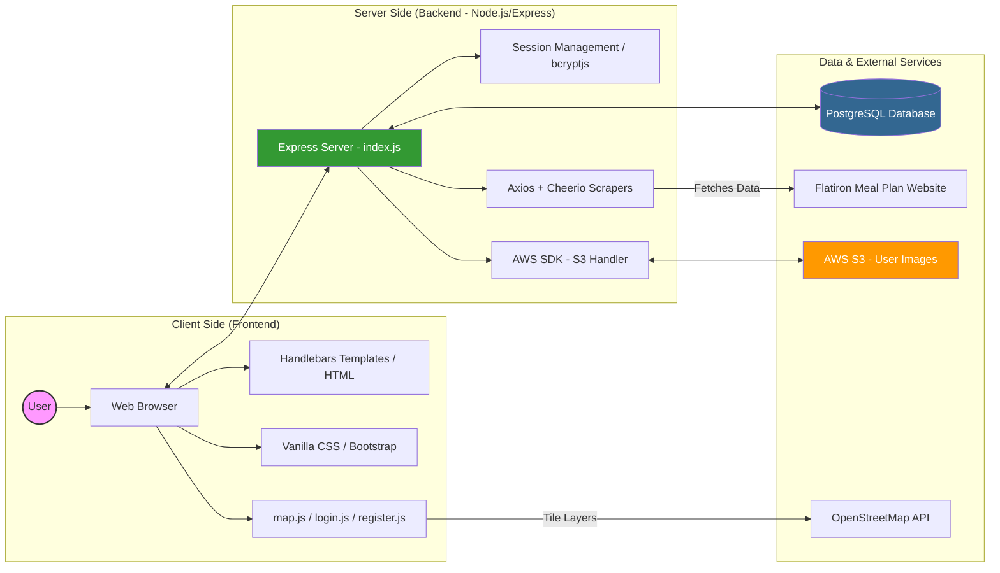

# System Architecture Diagram

This diagram visualizes the high-level architecture of the Flatiron Meal Plan Map, showing the interactions between the frontend, backend, database, and external services.

## Component Breakdown

- **Frontend**: Handles the user interface using Handlebars for templating and Leaflet.js (OpenStreetMap) for the interactive map.
- **Backend**: A Node.js and Express server that manages routing, authentication (via bcryptjs and sessions), and communication with external APIs.
- **Database**: A PostgreSQL instance (hosted on Render) that stores persistent data for users and restaurants.
- **Scrapers**: Custom logic using Axios and Cheerio to keep restaurant data and deals updated by pulling directly from the Flatiron Meal Plan site.
- **AWS S3**: Used for storing and serving user-uploaded profile images.
