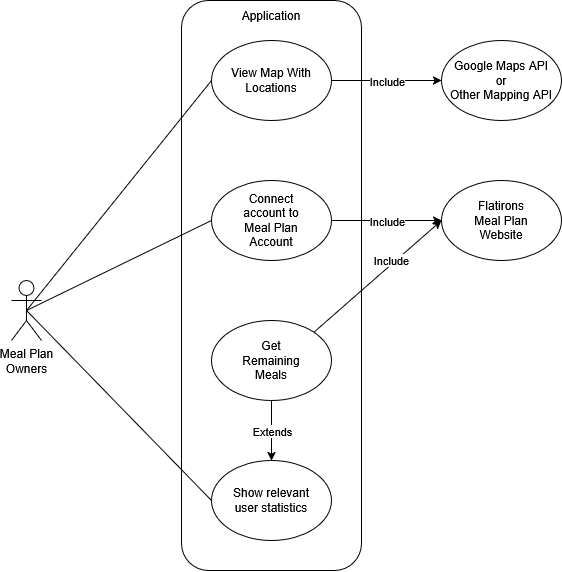
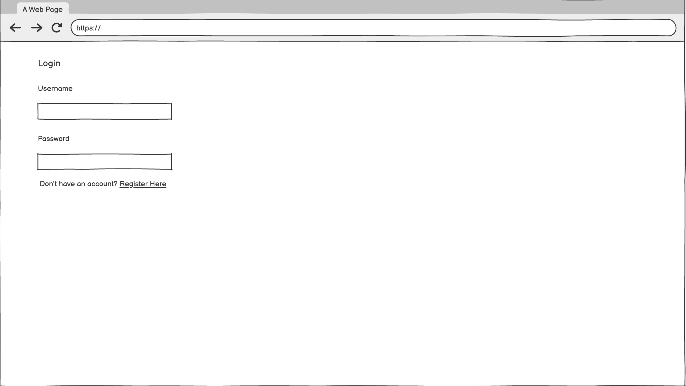
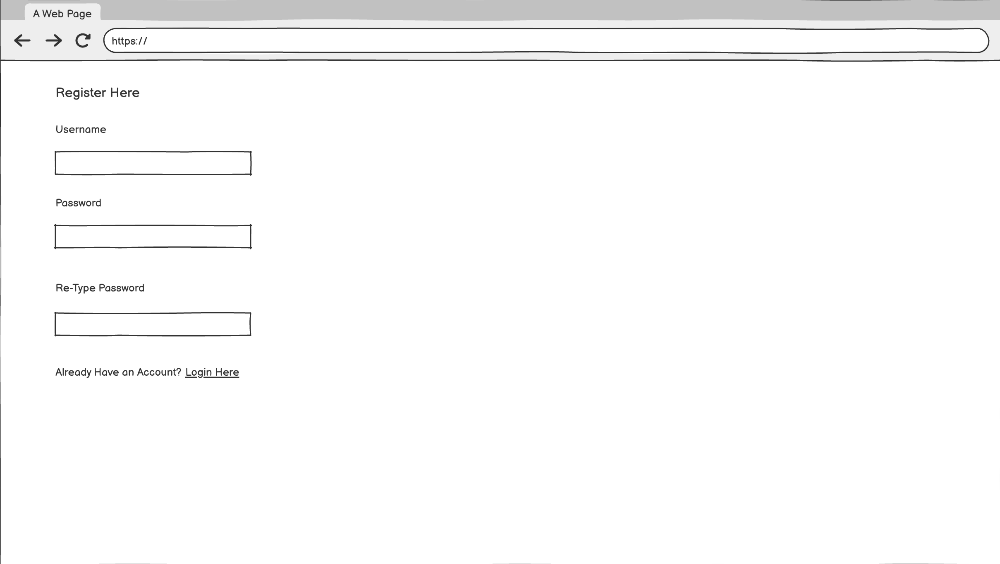
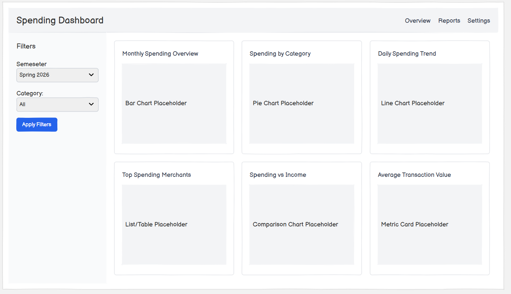
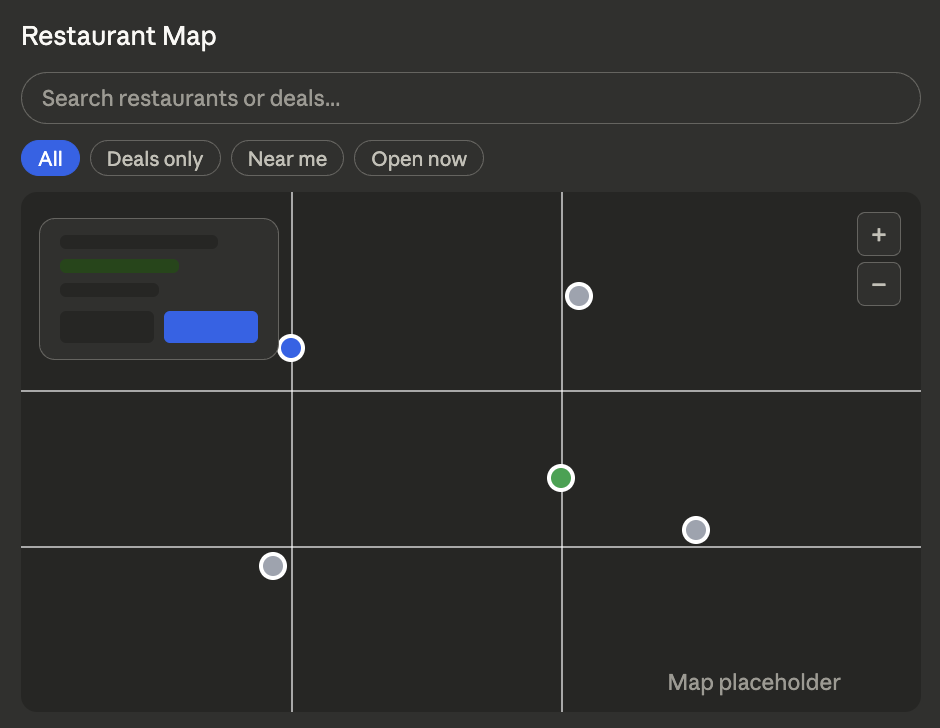

1. Team Number: 013-1

2. Team Name: Meal Mappers

3. Team Members: Pranav Konijeti, Garrett Smith, Hayden Sandau, Ryan Falender, Marie Viita 

4. Application Name: Flatiron Meal Map

5. Application Description: This app will be a map of all restaurants in Boulder that are included in the Flatiron meal plan. Not only will users be able to tell where each restaurant is located due to the map, users can also interact with the icons and see deals with each specific restaurant.

6. Audience: The ideal user would be anyone with a Flatiron Meal plan, usually being a CU Boulder student. This software aims to find restaurants that take this meal plan so that users can decide based on the deals and location whether to spend their meal plan on that location or not. Rather than making the user tediously look up each location one by one they will be able to easily click on each icon getting information on that restaurant.

7. Vision Statement: For CU Boulder students on the Flatiron meal plan who are tired of juggling tabs just to find lunch, the Flatiron Meal Map puts every restaurant and deal on one interactive map. Unlike the current portal, our app cuts out the confusing searching so students can spend less time hunting and more time eating.

8. Version Control: https://github.com/mrnobody978/Flatirons-Meal-Plan-Map

9. Development Methodology: We are choosing to use Agile Methodology.

10. Communication Plan: We are planning to use discord as our primary communication methodology.

11. Team Meeting Time: 8:00 p.m. - 8:30 p.m. on Thursdays, Modality: Online Discord. Weekly Meeting With TA: 4:30-4:45 on Tuesdays, Online on Zoom

12. Use Case Diagram: 

13. Wireframes: 

Extra Credit: 

Possible Risks and mitigation:
Data maintenance, if the restaurants on the plan or the deals they offer change the data can’t be hardcoded. Using a database would allow updates and changes to be made more easily. Even better would be querying data from the meal plan portal if possible.
Mobile map usage, students would most likely use this on their mobile devices so it is important to be able to display well on mobile and desktop. We should design with mobile in mind using Bootstrap or something similar.
Map api costs, using google maps can cost money depending on how much of a map we want, it might not be a problem with this small of a map but Mapbox is cheaper and leaflet .js is open source.
Scope creep, there are a lot of possible features we could add to this site, it is important to focus on the basics, map, login, and basic functionality before adding to many unneeded features. Focusing on too much to start could overload the group and hurt out efficiency. 
Map clutter, if the pins or restaurants are too close to each other it could be hard to make pop ups and display info. Making the map resizable would fix this.

